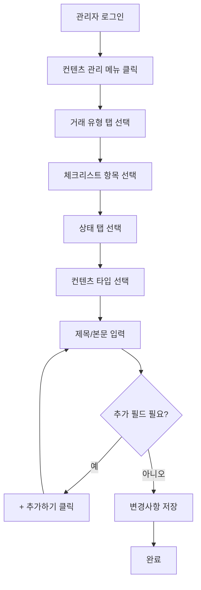

# 컨텐츠 관리 시스템 PRD

## Product Requirements Document

> 💡 **지킴진단 리포트 컨텐츠 관리 시스템**
>
> 부동산 진단 리포트의 체크리스트 항목별 컨텐츠를 상태와 타입에 따라 동적으로 관리하는 웹 기반 관리 시스템

---

# 1. 프로젝트 개요

## 1.1 제품 정보

| 항목 | 내용 |
| --- | --- |
| **제품명** | 지킴진단 컨텐츠 관리 시스템 |
| **버전** | 1.0 |
| **개발 환경** | HTML5, CSS3, Vanilla JavaScript |
| **대상 사용자** | 지킴진단 서비스 관리자, 컨텐츠 운영팀 |

## 1.2 비즈니스 목표

- 부동산 진단 리포트의 컨텐츠를 효율적으로 관리
- 거래 유형별, 건물 유형별 맞춤 컨텐츠 제공
- 상태별(안전/주의/경고) 차별화된 정보 전달
- 관리자의 컨텐츠 수정 시간 단축 및 생산성 향상

## 1.3 핵심 가치 제안

- ✅ **직관적인 UI**: 탭과 카드 기반의 시각적 인터페이스
- ✅ **유연한 컨텐츠 관리**: 동적 필드 추가/삭제 기능
- ✅ **체계적인 분류**: 6가지 거래 유형 × 21개 항목 × 3가지 상태 × 3가지 타입
- ✅ **실시간 피드백**: 즉각적인 UI 반응과 애니메이션

---

# 2. 시스템 아키텍처

## 2.1 전체 구조

```
지킴진단 Admin
├── 사이드바 네비게이션
│   ├── 로고 영역
│   └── 메뉴 (리포트 발급 이력, 컨텐츠 관리)
├── 상단 헤더
│   ├── 브레드크럼
│   └── 사용자 프로필
└── 메인 컨텐츠 영역
    ├── 페이지 헤더 (제목, 저장 버튼)
    └── 탭 컨테이너
        ├── 탭 헤더 (6개 거래 유형)
        └── 탭 컨텐츠
            └── 체크리스트 그리드 (21개 항목)
                ├── 상태 탭 (안전/주의/경고)
                ├── 컨텐츠 타입 라디오 (정의/안내/특약)
                └── 동적 입력 필드 리스트
```

## 2.2 데이터 계층 구조

```
거래 유형 (6개)
└── 체크리스트 항목 (21개)
    └── 상태 (3개: 안전/주의/경고)
        └── 컨텐츠 타입 (3개: 정의/안내/특약)
            └── 입력 필드 (N개: 동적)
                ├── 제목 (2줄)
                └── 본문 (3줄 이상)
```

---

# 3. 상세 기능 명세

## 3.1 거래 유형 탭 시스템

### 3.1.1 거래 유형 목록

| ID | 거래 유형 | 설명 |
| --- | --- | --- |
| `sale-multi` | 매매-집합건물 | 아파트, 오피스텔 등 |
| `sale-general` | 매매-일반건물 | 단독주택, 다가구 등 |
| `jeonse-multi` | 전세-집합건물 | 아파트, 오피스텔 전세 |
| `jeonse-general` | 전세-일반건물 | 단독주택, 다가구 전세 |
| `monthly-multi` | 월세-집합건물 | 아파트, 오피스텔 월세 |
| `monthly-general` | 월세-일반건물 | 단독주택, 다가구 월세 |

### 3.1.2 탭 전환 동작

**함수**: `openTab(evt, tabName)`

**동작 흐름**:

1. 모든 탭 컨텐츠 숨김 처리
2. 모든 탭 버튼 비활성화
3. 선택된 탭 컨텐츠 표시
4. 10ms 딜레이 후 fade-in 애니메이션 적용
5. 선택된 탭 버튼 활성화

**애니메이션**: 400ms cubic-bezier(0.16, 1, 0.3, 1)

## 3.2 체크리스트 항목 시스템

### 3.2.1 체크리스트 항목 배열

```javascript
const checklistItems = [
  "위반건축물",        // 0
  "대지권",           // 1
  "토지별도등기",      // 2
  "가등기",           // 3
  "압류/가압류",       // 4
  "처분금지가처분",    // 5
  "신탁",            // 6
  "경매개시결정",      // 7
  "근저당권",         // 8
  "임차권등기명령",    // 9
  "전세권",          // 10
  "민간임대주택등록 여부", // 11
  "등기사항 변경예정",    // 12
  "건물,토지 소유자 일치", // 13
  "임대사업자 등록",      // 14
  "보증금미반환 이력",    // 15
  "기존채무금액",        // 16
  "여유금액",           // 17
  "보증보험 예비심사",    // 18
  "보증금 대출 예비 심사", // 19
  "최우선 변제권"        // 20
];
```

### 3.2.2 체크리스트 렌더링

**함수**: `renderChecklist(containerId)`

**파라미터**:

- `containerId`: 렌더링할 컨테이너 ID (예: "sale-multi")

**동작**:

1. 21개 항목 순회
2. 각 항목마다 고유 ID 생성: `${containerId}-${index}`
3. 체크리스트 카드 HTML 생성
4. 3개 상태 탭 생성 (안전/주의/경고)
5. 각 상태별 컨텐츠 영역 생성
6. 컨테이너에 HTML 삽입

## 3.3 상태 관리 시스템

### 3.3.1 상태 유형

| 상태 | 클래스명 | 색상 | 의미 |
| --- | --- | --- | --- |
| 안전 | `safe` | 🟢 녹색 | 문제 없음 |
| 주의 | `caution` | 🟡 노란색 | 주의 필요 |
| 경고 | `warning` | 🔴 빨간색 | 위험 상태 |

### 3.3.2 상태 전환 함수

**함수**: `toggleStatusItem(uniqueId, status)`

**파라미터**:

- `uniqueId`: 체크리스트 항목의 고유 ID
- `status`: 전환할 상태 ('safe', 'caution', 'warning')

**동작**:

1. 해당 항목 컨테이너 찾기
2. 모든 상태 탭에서 `active` 클래스 제거
3. 선택된 상태 탭에 `active` 클래스 추가
4. 모든 상태 컨텐츠 영역 숨김
5. 선택된 상태 컨텐츠 영역 표시

### 3.3.3 상태별 플레이스홀더

**함수**: `getStatusName(status)`

| 입력 | 출력 |
| --- | --- |
| `'safe'` | '안전' |
| `'caution'` | '주의' |
| `'warning'` | '경고' |

## 3.4 컨텐츠 타입 시스템

### 3.4.1 컨텐츠 타입

| 타입 | 값 | 아이콘 | 설명 |
| --- | --- | --- | --- |
| 정의 | `definition` | 📖 | 항목에 대한 정의 및 설명 |
| 안내 | `guide` | 📝 | 사용자 가이드 및 주의사항 |
| 특약 | `special` | 📋 | 특약 사항 및 추가 정보 |

### 3.4.2 라디오 그룹 렌더링

**함수**: `renderRadioGroup(uniqueId, status)`

**파라미터**:

- `uniqueId`: 체크리스트 항목의 고유 ID
- `status`: 현재 상태 ('safe', 'caution', 'warning')

**생성 요소**:

1. 3개의 라디오 버튼 (정의/안내/특약)
2. 각 타입별 컨텐츠 입력 영역
3. 각 영역마다 동적 입력 필드 리스트
4. "+ 추가하기" 버튼

### 3.4.3 컨텐츠 타입 전환

**함수**: `toggleContentSection(uniqueId, status, type)`

**파라미터**:

- `uniqueId`: 체크리스트 항목의 고유 ID
- `status`: 현재 상태
- `type`: 선택된 컨텐츠 타입 ('definition', 'guide', 'special')

**동작**:

1. 현재 상태 컨테이너 찾기
2. 모든 컨텐츠 입력 영역 숨김
3. 선택된 타입의 입력 영역 표시

## 3.5 동적 입력 필드 시스템

### 3.5.1 입력 필드 구조

```html
<div class="input-wrapper-dynamic">
  <div class="input-header">
    <textarea class="title-input" rows="2">제목</textarea>
    <button class="btn-remove-field">삭제</button>
  </div>
  <textarea class="checklist-input" rows="3">본문</textarea>
</div>
```

### 3.5.2 입력 블록 생성

**함수**: `createInputBlock(placeholder, isRemovable = false)`

**파라미터**:

- `placeholder`: 본문 textarea의 플레이스홀더
- `isRemovable`: 삭제 버튼 표시 여부 (기본값: false)

**반환값**: HTML 문자열

**특징**:

- 첫 번째 필드는 삭제 불가 (`isRemovable = false`)
- 추가된 필드는 삭제 가능 (`isRemovable = true`)

### 3.5.3 필드 추가 기능

**함수**: `addInputField(containerId, placeholder)`

**파라미터**:

- `containerId`: 입력 필드를 추가할 리스트 컨테이너 ID
- `placeholder`: 본문 textarea의 플레이스홀더

**동작**:

1. 컨테이너 찾기
2. 새 입력 블록 생성 (`isRemovable = true`)
3. 컨테이너 끝에 HTML 삽입
4. fade-in 애니메이션 자동 적용

### 3.5.4 필드 삭제 기능

**구현**: 인라인 onclick 핸들러

```javascript
onclick="this.closest('.input-wrapper-dynamic').remove()"
```

**동작**:

1. 클릭된 버튼의 부모 `.input-wrapper-dynamic` 찾기
2. 해당 요소 DOM에서 제거

---

# 4. UI/UX 명세

## 4.1 레이아웃 시스템

### 4.1.1 전체 레이아웃

```css
.app-container {
  display: flex;
  min-height: 100vh;
}

.sidebar {
  width: 260px;
  position: fixed;
  height: 100vh;
}

.main-content {
  flex: 1;
  margin-left: 260px;
}
```

### 4.1.2 체크리스트 그리드

```css
.checklist-grid {
  display: grid;
  grid-template-columns: repeat(auto-fill, minmax(320px, 1fr));
  gap: 24px;
}
```

**특징**:

- 반응형 그리드
- 최소 컬럼 너비: 320px
- 자동 줄바꿈
- 24px 간격

## 4.2 상태별 색상 시스템

### 4.2.1 상태 탭 색상

| 상태 | 배경색 | 텍스트 색 | 테두리 색 |
| --- | --- | --- | --- |
| 안전 (active) | `#FFFFFF` | `#166534` | `#DCFCE7` |
| 주의 (active) | `#FFFFFF` | `#92400E` | `#FEF3C7` |
| 경고 (active) | `#FFFFFF` | `#991B1B` | `#FEE2E2` |

### 4.2.2 CSS 변수

```css
--status-success-bg: #DCFCE7;
--status-success-text: #166534;
--status-error-bg: #FEF3C7;
--status-error-text: #92400E;
--status-fail-bg: #FEE2E2;
--status-fail-text: #991B1B;
```

## 4.3 인터랙션 디자인

### 4.3.1 호버 효과

**체크리스트 카드**:

```css
.checklist-item:hover {
  border-color: var(--accent-color);
  box-shadow: var(--shadow-md);
  transform: translateY(-2px);
}
```

**추가 버튼**:

```css
.btn-add-field:hover {
  border-color: var(--accent-color);
  color: var(--accent-color);
  background: #F8FAFC;
}
```

### 4.3.2 애니메이션

**Fade In**:

```css
@keyframes fadeIn {
  from {
    opacity: 0;
    transform: translateY(10px);
  }
  to {
    opacity: 1;
    transform: translateY(0);
  }
}
```

**적용 대상**:

- 탭 컨텐츠 전환
- 상태 컨텐츠 전환
- 입력 필드 추가

---

# 5. 데이터 모델

## 5.1 컨텐츠 데이터 구조

```typescript
interface ContentManagementData {
  transactionType: TransactionType;
  checklistItems: ChecklistItem[];
}

type TransactionType = 
  | 'sale-multi' 
  | 'sale-general' 
  | 'jeonse-multi' 
  | 'jeonse-general' 
  | 'monthly-multi' 
  | 'monthly-general';

interface ChecklistItem {
  itemName: string;
  itemIndex: number;
  statuses: {
    safe: StatusContent;
    caution: StatusContent;
    warning: StatusContent;
  };
}

interface StatusContent {
  contentType: 'definition' | 'guide' | 'special';
  contents: ContentField[];
}

interface ContentField {
  title: string;
  body: string;
}
```

## 5.2 데이터 저장 예시

```json
{
  "transactionType": "sale-multi",
  "checklistItems": [
    {
      "itemName": "위반건축물",
      "itemIndex": 0,
      "statuses": {
        "safe": {
          "contentType": "definition",
          "contents": [
            {
              "title": "위반건축물이란?",
              "body": "건축법에 따른 허가를 받지 않거나 신고를 하지 않고 건축한 건축물"
            }
          ]
        },
        "caution": {
          "contentType": "guide",
          "contents": [
            {
              "title": "주의사항",
              "body": "경미한 위반사항이 있을 수 있으니 확인이 필요합니다."
            }
          ]
        },
        "warning": {
          "contentType": "special",
          "contents": [
            {
              "title": "특약 필수",
              "body": "위반건축물에 대한 시정 계획을 특약에 명시해야 합니다."
            }
          ]
        }
      }
    }
  ]
}
```

---

# 6. 기술 스택 및 구현

## 6.1 프론트엔드 기술

| 기술 | 버전 | 용도 |
| --- | --- | --- |
| HTML5 | - | 시맨틱 마크업 |
| CSS3 | - | 스타일링, 애니메이션 |
| JavaScript | ES6+ | 동적 UI, 이벤트 처리 |
| Google Fonts | - | Inter, Noto Sans KR |

## 6.2 주요 JavaScript 함수

### 6.2.1 함수 목록

| 함수명 | 파라미터 | 반환값 | 설명 |
| --- | --- | --- | --- |
| `renderChecklist` | `containerId` | void | 체크리스트 그리드 렌더링 |
| `renderRadioGroup` | `uniqueId`, `status` | HTML string | 라디오 그룹 HTML 생성 |
| `createInputBlock` | `placeholder`, `isRemovable` | HTML string | 입력 블록 HTML 생성 |
| `addInputField` | `containerId`, `placeholder` | void | 입력 필드 추가 |
| `getStatusName` | `status` | string | 상태 한글명 반환 |
| `toggleStatusItem` | `uniqueId`, `status` | void | 상태 탭 전환 |
| `toggleContentSection` | `uniqueId`, `status`, `type` | void | 컨텐츠 타입 전환 |
| `openTab` | `evt`, `tabName` | void | 거래 유형 탭 전환 |

### 6.2.2 초기화 코드

```javascript
// 모든 거래 유형 탭에 대해 체크리스트 렌더링
['sale-multi', 'sale-general', 'jeonse-multi', 
 'jeonse-general', 'monthly-multi', 'monthly-general']
  .forEach(id => {
    renderChecklist(id);
  });
```

## 6.3 CSS 설계 원칙

### 6.3.1 CSS Variables 활용

```css
:root {
  /* Colors */
  --primary-color: #0F172A;
  --accent-color: #3B82F6;
  --bg-color: #F8FAFC;
  
  /* Spacing */
  --spacing-xs: 4px;
  --spacing-sm: 8px;
  --spacing-md: 16px;
  --spacing-lg: 24px;
  --spacing-xl: 32px;
  
  /* Shadows */
  --shadow-sm: 0 1px 2px 0 rgb(0 0 0 / 0.05);
  --shadow-md: 0 4px 6px -1px rgb(0 0 0 / 0.1);
  --shadow-lg: 0 10px 15px -3px rgb(0 0 0 / 0.1);
}
```

### 6.3.2 BEM 네이밍 컨벤션

- Block: `.checklist-item`, `.status-tab`, `.input-wrapper-dynamic`
- Element: `.checklist-label`, `.input-header`, `.title-input`
- Modifier: `.active`, `.safe`, `.caution`, `.warning`

---

# 7. 사용자 시나리오

## 7.1 기본 컨텐츠 수정 플로우



## 7.2 상세 사용 시나리오

### 시나리오 1: 새로운 안내 문구 추가

**상황**: 매매-집합건물의 "위반건축물" 항목에 주의 상태 안내 문구 추가

**단계**:

1. "매매-집합건물" 탭 클릭
2. "위반건축물" 카드 찾기
3. "주의" 상태 탭 클릭
4. "안내" 라디오 버튼 선택
5. 기존 입력 필드에 내용 확인
6. "+ 추가하기" 버튼 클릭
7. 새로 생성된 제목 입력란에 "추가 확인 사항" 입력
8. 본문 입력란에 안내 문구 입력
9. "변경사항 저장" 버튼 클릭

### 시나리오 2: 불필요한 필드 삭제

**상황**: 전세-일반건물의 "근저당권" 항목에서 중복된 정의 삭제

**단계**:

1. "전세-일반건물" 탭 클릭
2. "근저당권" 카드 찾기
3. "안전" 상태 탭 클릭 (기본 선택)
4. "정의" 라디오 버튼 선택 (기본 선택)
5. 중복된 입력 필드의 "삭제" 버튼 클릭
6. 필드 즉시 제거 확인
7. "변경사항 저장" 버튼 클릭

### 시나리오 3: 상태별 컨텐츠 일괄 관리

**상황**: "가등기" 항목의 3가지 상태별 정의 모두 입력

**단계**:

1. 원하는 거래 유형 탭 선택
2. "가등기" 카드 찾기
3. "안전" 탭 → "정의" 선택 → 내용 입력
4. "주의" 탭 → "정의" 선택 → 내용 입력
5. "경고" 탭 → "정의" 선택 → 내용 입력
6. "변경사항 저장" 버튼 클릭

---

# 8. 비기능적 요구사항

## 8.1 성능 요구사항

| 항목 | 목표 | 측정 방법 |
| --- | --- | --- |
| 초기 로딩 시간 | < 2초 | DOMContentLoaded |
| 탭 전환 시간 | < 400ms | 애니메이션 완료 |
| 필드 추가 반응 시간 | < 100ms | 클릭 → DOM 삽입 |
| 메모리 사용량 | < 100MB | Chrome DevTools |

## 8.2 사용성 요구사항

### 8.2.1 접근성 (Accessibility)

- ✅ 키보드 네비게이션 지원
- ✅ 명확한 포커스 인디케이터
- ✅ 의미있는 HTML 구조
- ✅ 적절한 색상 대비 (WCAG 2.1 AA 수준)

### 8.2.2 사용자 경험

- ✅ 직관적인 아이콘 및 레이블
- ✅ 즉각적인 시각적 피드백
- ✅ 일관된 인터랙션 패턴
- ✅ 명확한 에러 메시지 (향후 구현)

## 8.3 호환성 요구사항

### 8.3.1 브라우저 지원

| 브라우저 | 최소 버전 | 테스트 상태 |
| --- | --- | --- |
| Chrome | 90+ | ✅ 지원 |
| Safari | 14+ | ✅ 지원 |
| Firefox | 88+ | ✅ 지원 |
| Edge | 90+ | ✅ 지원 |

### 8.3.2 화면 해상도

- **최소 지원**: 1280 × 720
- **권장**: 1920 × 1080
- **최대 컨텐츠 너비**: 1400px

## 8.4 보안 요구사항

> ⚠️ **현재 미구현 (향후 개발 필요)**

- [ ] 사용자 인증 및 권한 관리
- [ ] XSS 방지 (입력값 sanitization)
- [ ] CSRF 토큰
- [ ] HTTPS 통신
- [ ] 세션 타임아웃

---

# 9. 제약사항 및 한계

## 9.1 현재 제약사항

> ⚠️ **프로토타입 단계의 제약사항**

| 제약사항 | 설명 | 영향 |
| --- | --- | --- |
| 백엔드 미연동 | API 서버 없음 | 데이터 영속성 없음 |
| 데이터 저장 불가 | LocalStorage 미사용 | 새로고침 시 초기화 |
| 단일 사용자 | 동시 편집 불가 | 협업 불가 |
| 유효성 검사 없음 | 입력값 검증 미구현 | 잘못된 데이터 입력 가능 |
| 저장 기능 미구현 | alert만 표시 | 실제 저장 안됨 |

## 9.2 기술적 한계

- **상태 관리**: 전역 상태 관리 라이브러리 미사용
- **컴포넌트화**: 재사용 가능한 컴포넌트 구조 아님
- **타입 안정성**: TypeScript 미사용
- **테스트**: 단위 테스트 및 E2E 테스트 없음

## 9.3 가정 사항

> 💭 **개발 시 전제 조건**

- 관리자는 데스크톱 환경에서 작업
- 최신 브라우저 사용
- 안정적인 네트워크 환경
- 한국어 인터페이스만 지원
- 21개 체크리스트 항목 고정

---

# 10. 향후 개발 로드맵

## 10.1 Phase 2: 백엔드 연동 (우선순위: 높음)

### 10.1.1 API 개발

- [ ] RESTful API 설계
- [ ] 데이터베이스 스키마 설계
- [ ] CRUD 엔드포인트 구현
- [ ] 인증/인가 시스템

### 10.1.2 프론트엔드 연동

- [ ] Fetch API 또는 Axios 통합
- [ ] 로딩 상태 UI
- [ ] 에러 핸들링
- [ ] 낙관적 업데이트 (Optimistic Update)

### 10.1.3 데이터 영속성

```javascript
// 저장 API 예시
async function saveContent(data) {
  try {
    const response = await fetch('/api/content', {
      method: 'POST',
      headers: {
        'Content-Type': 'application/json',
        'Authorization': `Bearer ${token}`
      },
      body: JSON.stringify(data)
    });
    
    if (!response.ok) throw new Error('저장 실패');
    
    const result = await response.json();
    showSuccessMessage('저장되었습니다.');
    return result;
  } catch (error) {
    showErrorMessage('저장 중 오류가 발생했습니다.');
    console.error(error);
  }
}
```

## 10.2 Phase 3: 고급 기능 (우선순위: 중간)

### 10.2.1 사용자 경험 개선

- [ ] 실시간 미리보기
- [ ] 자동 저장 (Auto-save)
- [ ] 변경 이력 추적
- [ ] 실행 취소/다시 실행 (Undo/Redo)
- [ ] 검색 및 필터링

### 10.2.2 협업 기능

- [ ] 다중 사용자 동시 편집
- [ ] 변경 사항 충돌 해결
- [ ] 댓글 및 리뷰 시스템
- [ ] 승인 워크플로우

### 10.2.3 컨텐츠 관리 고도화

- [ ] 컨텐츠 템플릿 시스템
- [ ] 버전 관리
- [ ] 일괄 수정 기능
- [ ] 컨텐츠 복사/붙여넣기
- [ ] 드래그 앤 드롭 정렬

## 10.3 Phase 4: 확장 기능 (우선순위: 낮음)

### 10.3.1 다국어 지원

- [ ] i18n 라이브러리 통합
- [ ] 언어별 컨텐츠 관리
- [ ] 자동 번역 API 연동

### 10.3.2 분석 및 리포팅

- [ ] 컨텐츠 사용 통계
- [ ] 관리자 활동 로그
- [ ] 대시보드 및 차트

### 10.3.3 모바일 최적화

- [ ] 반응형 디자인 강화
- [ ] 터치 제스처 지원
- [ ] 모바일 전용 UI

---

# 11. 테스트 계획

## 11.1 단위 테스트 (Unit Test)

### 11.1.1 테스트 대상 함수

| 함수 | 테스트 케이스 |
| --- | --- |
| `getStatusName` | 'safe' → '안전', 'caution' → '주의', 'warning' → '경고' |
| `createInputBlock` | isRemovable true/false에 따른 삭제 버튼 유무 |
| `renderRadioGroup` | 올바른 HTML 구조 생성 확인 |

### 11.1.2 테스트 프레임워크

- **Jest**: JavaScript 단위 테스트
- **Testing Library**: DOM 테스트

## 11.2 통합 테스트 (Integration Test)

### 11.2.1 테스트 시나리오

1. **탭 전환 테스트**
   - 거래 유형 탭 클릭 → 해당 컨텐츠 표시 확인

2. **상태 전환 테스트**
   - 상태 탭 클릭 → 해당 상태 컨텐츠 표시 확인

3. **필드 추가/삭제 테스트**
   - 추가 버튼 클릭 → 새 필드 생성 확인
   - 삭제 버튼 클릭 → 필드 제거 확인

## 11.3 E2E 테스트 (End-to-End Test)

### 11.3.1 테스트 도구

- **Playwright** 또는 **Cypress**

### 11.3.2 주요 시나리오

```javascript
// Playwright 예시
test('컨텐츠 수정 전체 플로우', async ({ page }) => {
  await page.goto('/content-management.html');
  
  // 탭 선택
  await page.click('button:has-text("매매-집합건물")');
  
  // 상태 선택
  await page.click('.status-tab.caution');
  
  // 컨텐츠 타입 선택
  await page.click('input[value="guide"]');
  
  // 제목 입력
  await page.fill('.title-input', '테스트 제목');
  
  // 본문 입력
  await page.fill('.checklist-input', '테스트 본문');
  
  // 필드 추가
  await page.click('.btn-add-field');
  
  // 저장
  await page.click('.btn-primary');
  
  // Alert 확인
  page.on('dialog', dialog => dialog.accept());
});
```

---

# 12. 배포 및 운영

## 12.1 배포 환경

### 12.1.1 개발 환경

- **로컬 서버**: Live Server (VS Code Extension)
- **포트**: 5500 (기본값)
- **Hot Reload**: 자동 새로고침

### 12.1.2 프로덕션 환경 (향후)

- **웹 서버**: Nginx 또는 Apache
- **CDN**: CloudFlare
- **도메인**: admin.jikim.com (예시)
- **SSL**: Let's Encrypt

## 12.2 모니터링 (향후 구현)

### 12.2.1 성능 모니터링

- **Google Analytics**: 사용자 행동 분석
- **Sentry**: 에러 추적
- **Lighthouse**: 성능 점수 측정

### 12.2.2 로깅

```javascript
// 로깅 예시
function logUserAction(action, data) {
  console.log(`[${new Date().toISOString()}] ${action}`, data);
  
  // 향후 서버로 전송
  // sendToAnalytics(action, data);
}

// 사용 예시
logUserAction('TAB_CHANGED', { tabName: 'sale-multi' });
logUserAction('FIELD_ADDED', { itemId: 'sale-multi-0', status: 'safe' });
```

---

# 부록

## A. 코드 참조

### A.1 주요 파일 구조

```
jikim-admin/
├── index.html              # 리포트 발급 이력 페이지
├── content-management.html # 컨텐츠 관리 페이지 (본 문서 기준)
├── style.css              # 공통 스타일시트
└── script.js              # 공통 JavaScript (선택사항)
```

### A.2 HTML 구조 요약

```html
<!DOCTYPE html>
<html lang="ko">
<head>
  <!-- Meta, Fonts, CSS -->
</head>
<body>
  <div class="app-container">
    <aside class="sidebar">...</aside>
    <main class="main-content">
      <header class="top-header">...</header>
      <div class="content-wrapper">
        <div class="page-header">...</div>
        <div class="tabs-container">
          <div class="tabs-header">...</div>
          <div class="tab-content">...</div>
        </div>
      </div>
    </main>
  </div>
  <script>
    // JavaScript 코드
  </script>
</body>
</html>
```

## B. 용어 사전

| 용어 | 영문 | 설명 |
| --- | --- | --- |
| 체크리스트 항목 | Checklist Item | 리포트에서 검토하는 21개 부동산 관련 항목 |
| 거래 유형 | Transaction Type | 매매/전세/월세 × 집합/일반건물 (6가지) |
| 상태 | Status | 안전/주의/경고 (3가지) |
| 컨텐츠 타입 | Content Type | 정의/안내/특약 (3가지) |
| 동적 필드 | Dynamic Field | 추가/삭제 가능한 입력 필드 |
| 고유 ID | Unique ID | `${containerId}-${index}` 형식의 식별자 |

## C. 디자인 토큰

### C.1 색상 팔레트

```css
/* Primary Colors */
--primary-color: #0F172A;      /* Deep Navy */
--primary-light: #1E293B;
--accent-color: #3B82F6;       /* Bright Blue */

/* Background Colors */
--bg-color: #F8FAFC;
--card-bg: #FFFFFF;

/* Text Colors */
--text-primary: #1E293B;
--text-secondary: #64748B;

/* Border Colors */
--border-color: #E2E8F0;

/* Status Colors */
--status-success-bg: #DCFCE7;  /* Green */
--status-success-text: #166534;
--status-error-bg: #FEF3C7;    /* Yellow */
--status-error-text: #92400E;
--status-fail-bg: #FEE2E2;     /* Red */
--status-fail-text: #991B1B;
```

### C.2 타이포그래피

```css
/* Font Family */
font-family: 'Inter', 'Noto Sans KR', sans-serif;

/* Font Sizes */
--font-xs: 12px;
--font-sm: 13px;
--font-base: 14px;
--font-lg: 18px;
--font-xl: 24px;

/* Font Weights */
--font-normal: 400;
--font-medium: 500;
--font-semibold: 600;
--font-bold: 700;
```

## D. 참고 자료

- **디자인 시스템**: [Tailwind CSS](https://tailwindcss.com/)
- **폰트**: [Google Fonts - Inter](https://fonts.google.com/specimen/Inter), [Noto Sans KR](https://fonts.google.com/specimen/Noto+Sans+KR)
- **아이콘**: 이모지 (향후 [Heroicons](https://heroicons.com/) 또는 [Lucide](https://lucide.dev/) 검토)
- **애니메이션**: CSS Transitions & Keyframes

---

**문서 버전**: 1.0  
**최종 수정일**: 2025-12-04  
**작성자**: 지킴진단 개발팀  
**문서 상태**: ✅ 승인됨
